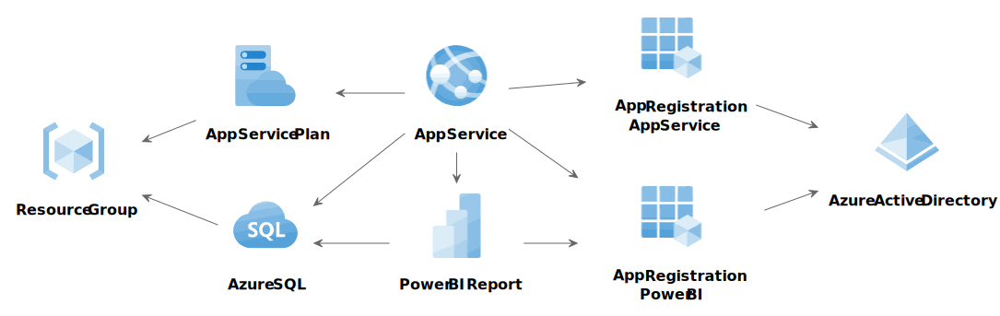

# Praca inżynierska

## Temat

Projekt i implementacja systemu do wizualizacji danych w chmurze Azure z wykorzystaniem metod automatycznego wdrażania

## Cel

Celem pracy jest zaprojektowanie i zaimplementowanie platformy do wizualizacji danych społeczno-gospodarczych z publicznych baz. Portal będzie dostępny w chmurze Azure, a jego wdrożenie zostanie zautomatyzowane z wykorzystaniem narzędzi DevOps.

## Zakres

Praca obejmuje projekt, implementację i automatyczne wdrożenie systemu do wizualizacji i analizy danych społeczno-gospodarczych w chmurze Azure. Analiza danych będzie realizowana przy użyciu narzędzia Power BI, natomiast aplikacja internetowa zostanie przygotowana z użyciem frameworka ASP.NET Core w języku C#. Dane będą przechowywane w bazie danych SQL Server, z użyciem usługi Azure SQL Database. Do automatycznego wdrażania zostaną wykorzystane skrypty PowerShell wraz z biblioteką Azure PowerShell oraz narzędziem Terraform.

